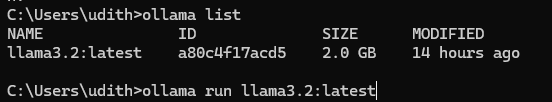
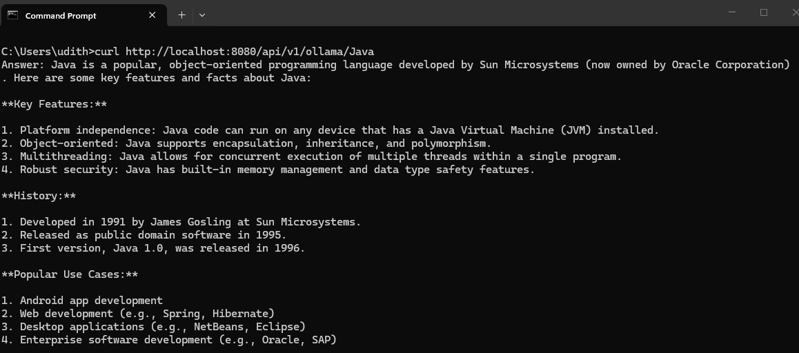
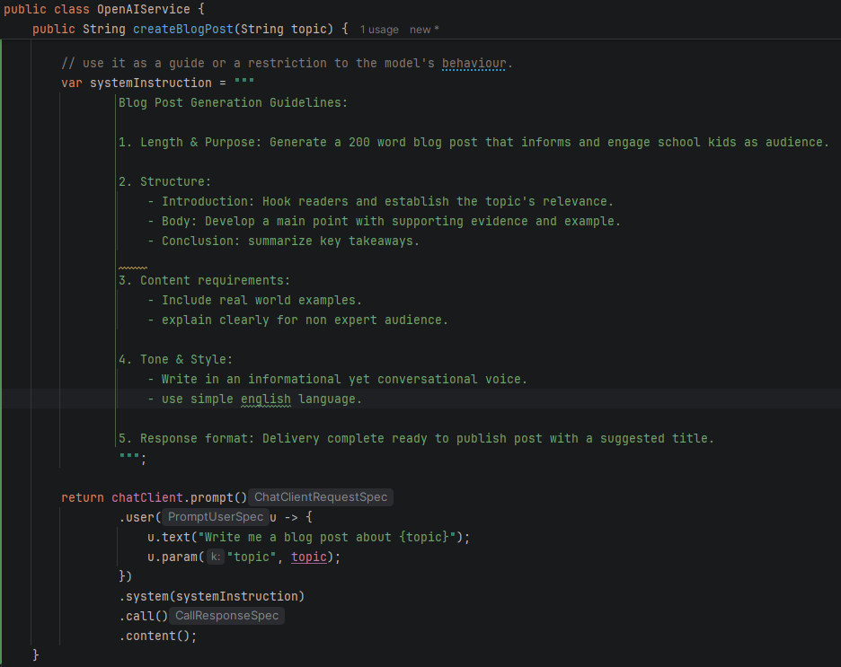
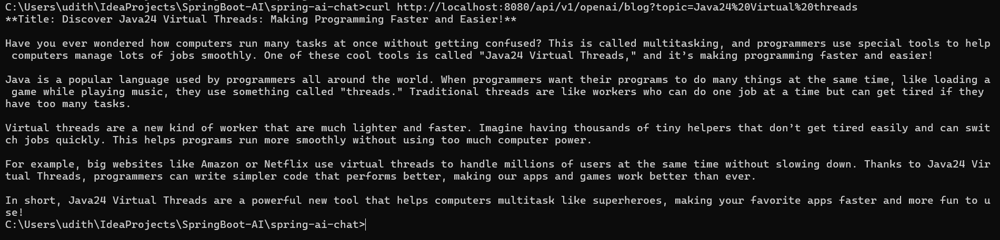

# Getting Started with Spring AI

### Tools, Frameworks used
* Java 21
* Springboot 3.5
* Spring AI (v 1.1.2)

### Simple chat application using the following AI models

* Anthropic - Claude (paid LLM)
* OpenAI - ChatGPT (paid LLM)
* Ollama: Free AI model running locally. installation steps mentioned below.

**AnthropicChatController:**
    uses the  **AnthropicChatModel** to connect to their servers to retrieve answers for the given message.

**OpenAIChatController:**
    uses the **OpenAiChatModel** to connect to their servers to retrieve answers for the given message.

**OllamaChatController**
    uses the **OllamaChatModel** to connect to the AI model running locally. There is no cost when using this model, 
    but the data is limited depending on the AI model running in local machine. 

### Ollama (https://ollama.com/)
  Free tool that allows to use open models to build AI powered application. Has hundreds of AI models like OpenAI, Anthropic, Deepseek, etc
  that can be downloaded to your local machine and integrate with your application.

below are the steps used to integrate Ollama with this Spring boot AI application.

* download Ollama from the above mentioned website and install the tool.

* search for a model that suits your for your purpose from https://ollama.com/search
  (some models are very large and will take lot of resources to run internally. check for the size and use accordingly.
  To have a good dataset, better to have a large model).

* some commands that can be used from command line
    
        ollama list
        ollama run <model_name>

    

* In your springboot app, add the following to your application.yml file. (no need to run to manually in command prompt)
        
        spring:  
          ai:
            ollama:
              chat:
                options:
                  model: llama3.2:latest

* add the following to the pom file (add other models as required)
        
        dependencies section:
          <dependency>
              <groupId>org.springframework.ai</groupId>
              <artifactId>spring-ai-starter-model-ollama</artifactId>
          </dependency>
        
        dependencyManagement section:
            <dependency>
                <groupId>org.springframework.ai</groupId>
                <artifactId>spring-ai-bom</artifactId>
                <version>${spring-ai.version}</version>
                <type>pom</type>
                <scope>import</scope>
            </dependency>

* add the **ChatClient** and use the client to send a prompt to the AI model as mentioned in the service classes in this project.

* run the application.

      mvn spring-boot:run

* send a http request to the controller endpoints

      curl http://localhost:8080/api/v1/ollama/Java
* spring will initialize the ollama AI model and send the request message (in this case 'Java') as a prompt to get the answer.

  

**Note**: Anthropic (Claude) and OpenAI (ChatGPT) are paid LLM agents and will not give a response if no proper api-key and credits available.

### Troubleshooting

* If the api-key is not properly configured to an AI model

      org.springframework.ai.retry.NonTransientAiException: HTTP 401 - {
        "error": {
          "message": "Incorrect API key provided: sk-proj-********xxxx. You can find your API key at https://platform.openai.com/account/api-keys.",
          "type": "invalid_request_error",
          "code": "invalid_api_key",
          "param": null
        },
      "status": 401
      }

* If api-key is correct, but have no credit to cater the request (openai)

      org.springframework.ai.retry.NonTransientAiException: HTTP 429 - {
        "error": {
          "message": "You exceeded your current quota, please check your plan and billing details. For more information on this error, read the docs: https://platform.openai.com/docs/guides/error-codes/api-errors.",
          "type": "insufficient_quota",
          "param": null,
          "code": "insufficient_quota"
        }
      }

### OpenAI (https://platform.openai.com/)

Paid LLM that can be used to get accurate answers. ChatGPT is one of OpenAI's AI tool.

#### Scenarios implemented

1) system instruction provided to create a blog post.

       Controller method:
       public String blogPost(@RequestParam(value = "topic", defaultValue = "JDK Virtual Threads") String topic)
  
   The LLM goes through these instructions when generating the answer.

   

   Response given by OpenAI LLM for the above.

  

2) Read details from a image provided and return a text describing the image

       Controller method:
       @GetMapping("/read")
       public String describeImage()

    Response:
 
       The image shows a scenic landscape with a large pyramid-like structure in the center,
       surrounded by greenery and trees. There are several colorful hot air balloons floating in the sky above the pyramid.
       In the background, there are hills or mountains under a clear blue sky. The lighting suggests it might be early morning or late afternoon,
       casting a warm glow over the scene. The overall atmosphere is peaceful and picturesque.

3) Generate an image according to the ImageOptions provided

       Controller method:
       @GetMapping("/generate")
       public ResponseEntity<Map<String, String>> generateImage(
       @RequestParam(defaultValue = "a beautiful sunset over the ocean") String prompt)

   Response:

   

